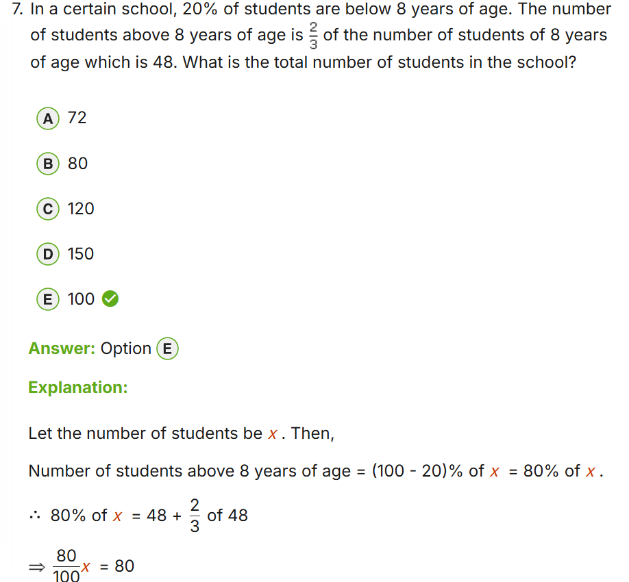
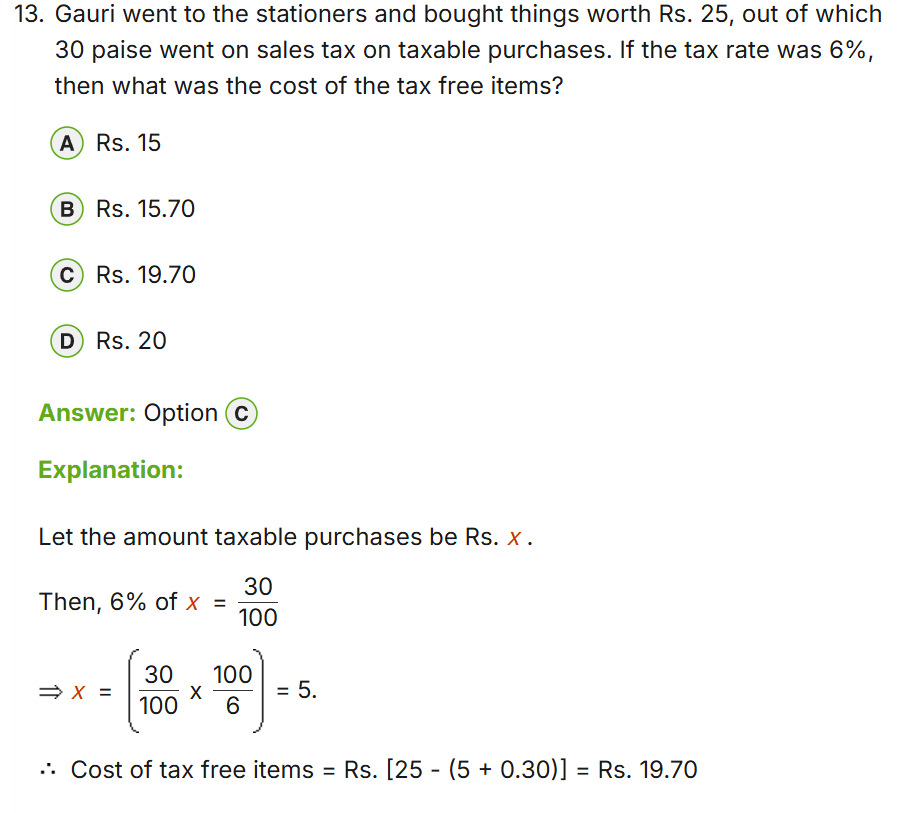
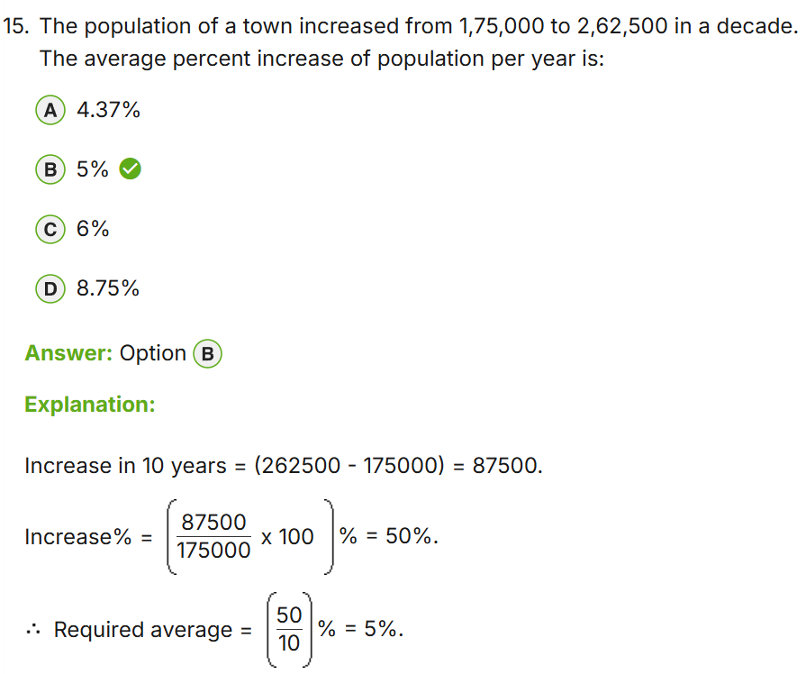
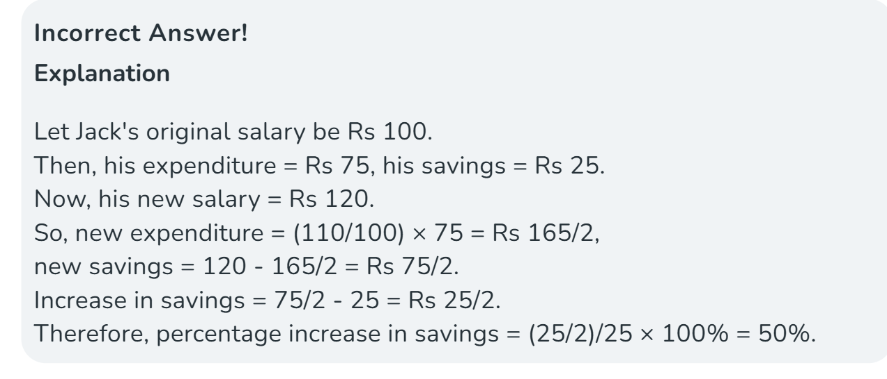
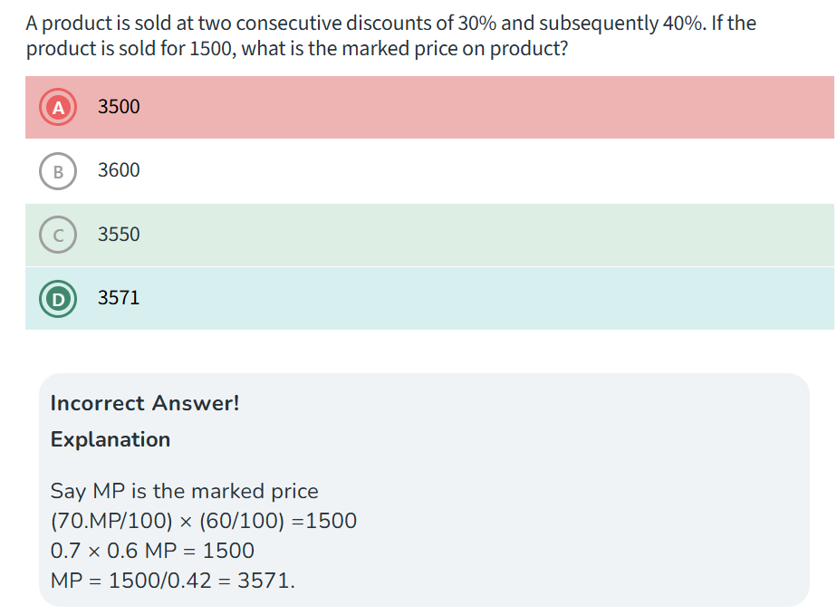

# Percentage – Exam Patterns, Concepts & Tricks
## For: TCS NQT & Placement Aptitude Rounds

---

## CORE FORMULA BANK

| Need to find | Formula |
|---|---|
| X% of Y | Y × X/100 |
| X is what % of Y | (X/Y) × 100 |
| % increase | (Increase / Original) × 100 |
| % decrease | (Decrease / Original) × 100 |
| Original before increase | New × 100 / (100 + r) |
| Original before decrease | New × 100 / (100 − r) |
| Population after n years | P × (1 + r/100)^n |
| Depreciation after n years | P × (1 − r/100)^n |

---

## EXAM PATTERNS (Most Frequent → Least Frequent)

### Pattern 1 – Basic Calculation
- X% of Y = Y × X/100
- "120 is what % of 960?" → (120/960) × 100 = 12.5%

### Pattern 2 – % Increase / Decrease
- New = Old × (1 ± r/100)
- % change = (Difference / Original) × 100

### Pattern 3 – Successive % Changes ⭐⭐
- Net % = a + b + (ab/100)   [use negative sign for decrease]
- +20% then −20% = 20−20+(20×−20/100) = −4% (net loss)
- +10% then +10% = 10+10+1 = +21%

### Pattern 4 – % Change in Product (area/revenue)
- Both dimensions change → net change = a + b + ab/100
- Length+10%, Width+10% → Area +21%
- Revenue = Price × Quantity; if price +r%, qty falls by r/(100+r)×100 % to keep same revenue

### Pattern 5 – Reversal (Find Original Value)
- After +r%, value = V → Original = V × 100/(100+r)
- After −r%, value = V → Original = V × 100/(100−r)

### Pattern 6 – Expenditure Constant Trick
- Price rises by r% → reduce consumption by r/(100+r) × 100 %
- Price up 25% → reduce consumption by 25/125 × 100 = 20%
- Price up 20% → reduce consumption by 20/120 × 100 = 16.67%

### Pattern 7 – Population / Depreciation
- Future = Present × (1 ± r/100)^n
- Can be combined: 2 years different rates → multiply (1+r1/100)(1+r2/100)

### Pattern 8 – Percentage Points Trap
- "Went from 40% to 50%" = 10 percentage points, but 25% increase in rate
- Exams test this confusion deliberately

---

## FRACTION ↔ PERCENTAGE TABLE (Memorize these!)

| Fraction | % Equivalent |
|---|---|
| 1/2 | 50% |
| 1/3 | 33.33% |
| 2/3 | 66.67% |
| 1/4 | 25% |
| 3/4 | 75% |
| 1/5 | 20% |
| 2/5 | 40% |
| 3/5 | 60% |
| 4/5 | 80% |
| 1/6 | 16.67% |
| 5/6 | 83.33% |
| 1/7 | 14.28% |
| 1/8 | 12.5% |
| 3/8 | 37.5% |
| 5/8 | 62.5% |
| 7/8 | 87.5% |
| 1/9 | 11.11% |
| 1/10 | 10% |
| 1/11 | 9.09% |
| 1/12 | 8.33% |

---

## SPEED TRICKS

### Trick 1 – Multiply-Divide Shortcut
- 12.5% = 1/8 → divide by 8 (faster than ×12.5/100)
- 33.33% = 1/3 → divide by 3
- 16.67% = 1/6 → divide by 6

### Trick 2 – Successive % Memorized Results
- +10% then −10% = −1%
- +20% then −20% = −4%
- +25% then −25% = −6.25%
- +50% then −50% = −25%
- Rule: always a net loss = (r/10)^2 / 100

### Trick 7 – Successive % Universal Formula (Sign-Aware)
- Formula: Net % = a + b + (ab/100)  ← a and b carry their OWN signs
- Both discounts → a and b are negative → ab/100 is POSITIVE (reduces total discount)
  Example: −30% and −40% → −30−40+(−30×−40/100) = −70+12 = −58%
- Both increases → a and b are positive → ab/100 is POSITIVE (adds to increase)
  Example: +10% and +20% → 10+20+(10×20/100) = 30+2 = +32%
- One increase, one decrease → ab/100 is NEGATIVE (reduces net result)
  Example: +20% and −10% → 20−10+(20×−10/100) = 10−2 = +8%

| Situation | ab/100 sign | Effect |
|---|---|---|
| Both discounts | + (neg×neg) | Reduces total discount |
| Both increases | + (pos×pos) | Adds to total increase |
| One each | − (pos×neg) | Reduces net result |

⚠️ Textbooks write −ab/100 only for the discount case (both negative). The universal formula always uses + and lets the signs do the work.

### Trick 3 – Finding X% of Y by Reversal
- 8% of 75 = 75% of 8 = 6 (swap when one is easier)
- 16% of 25 = 25% of 16 = 4

### Trick 4 – Base Change Alert
- "A is 25% more than B" ≠ "B is 25% less than A"
- A is 25% more than B → B is 20% less than A
  (Because base changes: 25% of B ≠ 25% of A)
- Formula: if A is r% more than B, then B is r/(100+r) × 100 % less than A

### Trick 5 – Quick % of 100+
- 15% of 340 = 15% of 300 + 15% of 40 = 45 + 6 = 51

### Trick 6 – Percentage Multiplier Chain
- Increase by 10%, then 20%, then 30% = 1.1 × 1.2 × 1.3 = 1.716 → +71.6%

---

## COMMON TRAPS IN EXAMS

1. Successive % are NOT additive: +20% and −20% ≠ 0
2. "A is r% more than B" and "B is r% less than A" — different bases
3. "% points" vs "%" — percentage points are absolute, % is relative
4. When population decreases for n years at different rates — multiply all factors
5. "Increased by 1/5th" = increased by 20%, not 25%
6. "Average % increase per year" = Total % ÷ n (simple), NOT compound formula
7. Successive discounts are NOT additive: 30%+40% ≠ 70% off
   → Always multiply: (1−0.30)(1−0.40) = 0.7×0.6 = 0.42 → 58% net discount
   → Net discount formula: a + b − ab/100
   → Find MP from SP: MP = SP / [(1−a/100)(1−b/100)]

---

## SOLVED TRAPS FROM PRACTICE

### Q: Population 1,75,000 → 2,62,500 in 10 years. Average % increase per year?
- "Average" = simple → Total % = (87500/175000)×100 = 50% → 50/10 = **5% per year**
- Do NOT use (1+r/100)^10 here — that's for compound/actual growth rate (~4.14%)
- Keyword trap: "average percent increase" = simple division always

### Q: Two successive discounts 30% and 40%, SP=1500. Find MP.
- MP × 0.7 × 0.6 = 1500 → MP × 0.42 = 1500 → MP = **3571**
- Trap: Students add 30+40=70% → think SP = 30% of MP → get 5000 ❌
- Rule: Consecutive discounts MULTIPLY, never add

---

## PRACTICE PROBLEM TYPES (TCS NQT Frequency)
1. Salary increase/decrease and find original or new value
2. Population growth over multiple years
3. Successive discounts / markups
4. Income/Expenditure with price change and keeping budget same
5. Two students' marks difference expressed as percentage
6. Election votes as percentage
7. Passing % marks problems

