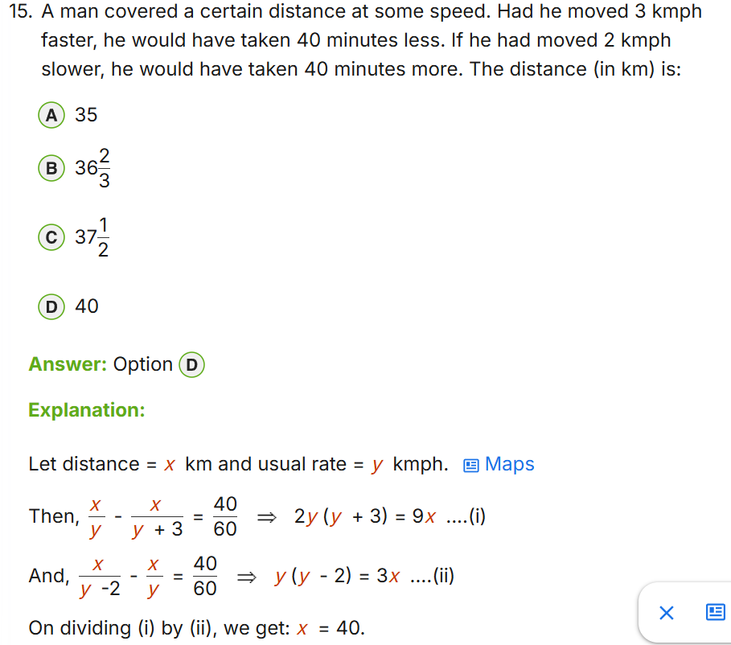
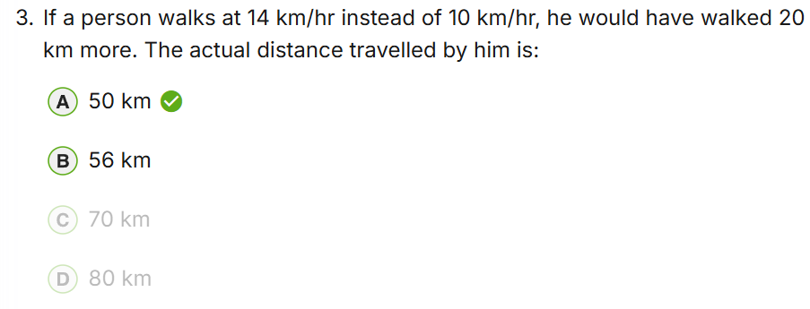
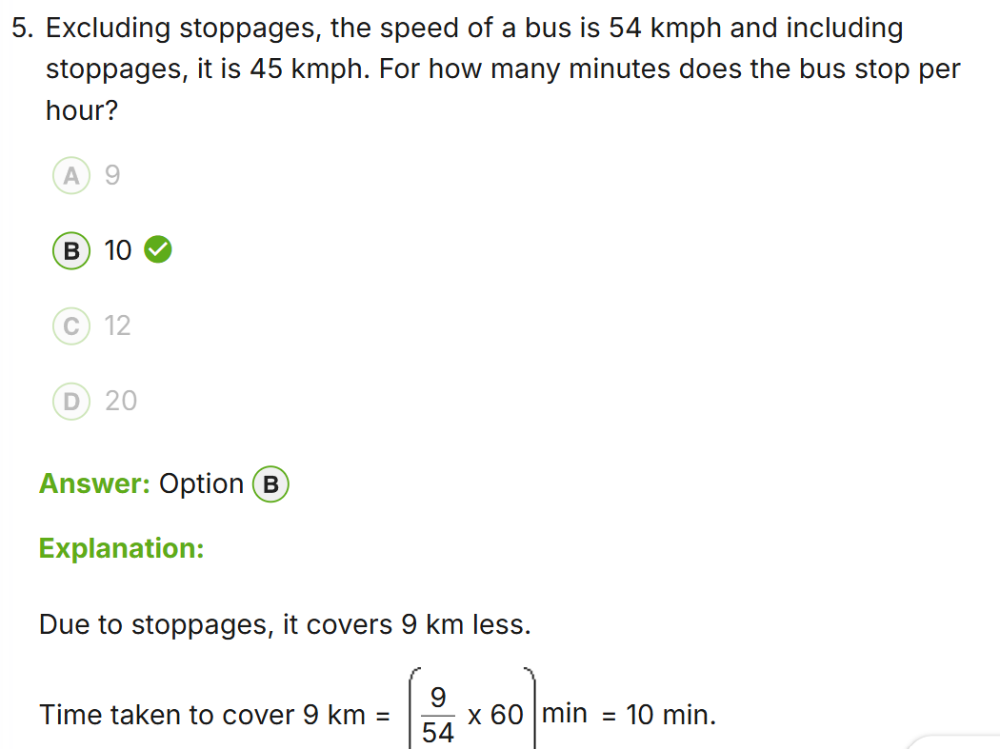
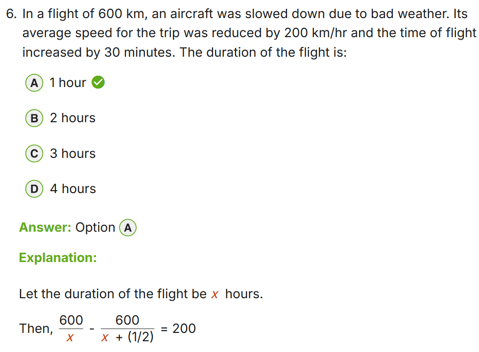
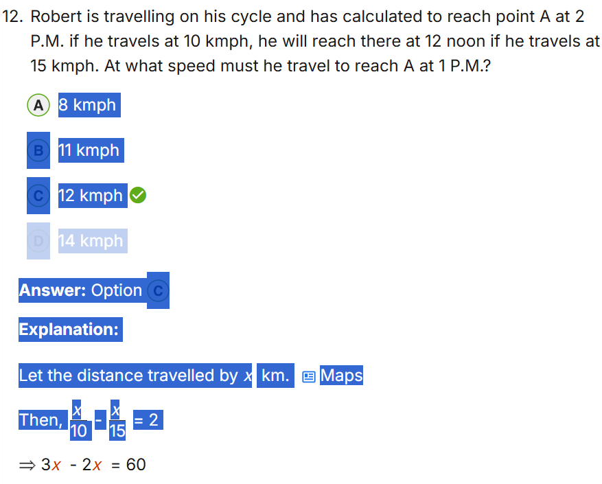

# Time, Speed & Distance - Exam Patterns, Concepts & Tricks
## For: TCS NQT & Placement Aptitude Rounds

---

## CORE TERMINOLOGY

| Term | Meaning |
|---|---|
| Speed | Distance covered per unit time |
| Distance | Total path covered |
| Time | Duration taken to cover distance |
| Average Speed | Total Distance / Total Time (NOT average of speeds) |
| Relative Speed | Speed of one object w.r.t. another |

---

## CORE FORMULA BANK

| Need to find | Formula |
|---|---|
| Speed | Distance / Time |
| Distance | Speed x Time |
| Time | Distance / Speed |
| Average Speed (two legs, same distance) | 2xy / (x + y) [Harmonic Mean] |
| Average Speed (two legs, same time) | (x + y) / 2 [Arithmetic Mean] |
| Relative Speed (same direction) | |S1 - S2| |
| Relative Speed (opposite direction) | S1 + S2 |
| Time to meet (opposite direction) | Distance / (S1 + S2) |
| Time to meet (same direction) | Distance / |S1 - S2| |

---

## UNIT CONVERSIONS (Must Memorize)

| Convert | Multiply by |
|---|---|
| km/hr to m/s | x 5/18 |
| m/s to km/hr | x 18/5 |

Examples:
- 72 km/hr = 72 x 5/18 = 20 m/s
- 15 m/s = 15 x 18/5 = 54 km/hr

---

## EXAM PATTERNS (Most Frequent to Least Frequent)

### Pattern 1 - Basic Speed/Distance/Time [FREQUENT]
Direct substitution into D = S x T.
- A covers 150 km in 3 hrs → Speed = 50 km/hr
- Speed = 60 km/hr, Time = 2.5 hrs → Distance = 150 km

### Pattern 2 - Average Speed [VERY FREQUENT - MOST TRAPS]
Never average the speeds directly. Always use Total D / Total T.
Case A: Same distance both ways (d each way), speeds x and y
  → Avg Speed = 2xy / (x+y)
  Example: 60 km/hr onward, 40 km/hr return
  → Avg = 2x60x40 / (60+40) = 4800/100 = 48 km/hr (NOT 50)

Case B: Same time both legs, speeds x and y
  → Avg Speed = (x+y)/2 (arithmetic mean, safe to average here)

Case C: Three legs with different speeds → must calculate each time separately

### Pattern 3 - Relative Speed: Trains [VERY FREQUENT]
Sub-types:
a) Train crossing a pole/person (stationary point):
   Time = Length of train / Speed of train

b) Train crossing a platform/bridge:
   Time = (Length of train + Length of platform) / Speed of train

c) Two trains same direction:
   Time to cross each other = (L1 + L2) / |S1 - S2|

d) Two trains opposite direction:
   Time to cross each other = (L1 + L2) / (S1 + S2)

### Pattern 4 - Boats and Streams [FREQUENT]
- Downstream speed = B + R (boat + river current)
- Upstream speed = B - R (boat - river current)
- Speed of boat in still water = (Downstream + Upstream) / 2
- Speed of stream = (Downstream - Upstream) / 2

### Pattern 5 - Meeting / Catching Problems [FREQUENT]
Two people start from A and B towards each other:
- Time to meet = Distance between them / (S1 + S2)

One person chasing another (same direction):
- Time to catch = Gap between them / (S1 - S2)   [S1 > S2]

### Pattern 6 - Races [FREQUENT]
- "A beats B by 10m in a 100m race" → when A finishes 100m, B has run 90m
- "A beats B by 5 seconds" → A finishes in T seconds, B takes T+5 seconds
- "A gives B a start of 10m" → B starts 10m ahead of A
- Combined: "A beats B by 10m or 5 sec" → B runs 10m in 5 sec → B's speed = 2 m/s

### Pattern 7 - Circular Track [FREQUENT]
Two people on circular track of length L:
- Opposite direction → meet every L/(S1+S2) time
- Same direction → meet every L/|S1-S2| time
- Number of meetings in time T = T / meeting interval

### Pattern 8 - Late/Early Arrival (Speed Change Problems) [VERY FREQUENT]
"Person reaches late by x min if speed is S1, early by y min if speed is S2"
- Distance = S1 x S2 x (x+y) / (S2-S1)   [x = late mins, y = early mins, S2 > S1]

### Pattern 9 - Clocks (related to TSD concept)
- Minute hand speed = 6 degrees/min
- Hour hand speed = 0.5 degrees/min
- Relative speed = 5.5 degrees/min
- Hands coincide every 720/11 = 65.45 minutes
- Angle between hands at H:MM = |30H - 5.5M|

---

## SPEED TRICKS

### Trick 1 - km/hr to m/s Flash Conversion
- Divide by 3.6 OR multiply by 5/18
- Common values to memorize:
  18 km/hr = 5 m/s | 36 km/hr = 10 m/s | 54 km/hr = 15 m/s
  72 km/hr = 20 m/s | 90 km/hr = 25 m/s | 108 km/hr = 30 m/s

### Trick 2 - Average Speed When Same Distance
- Always 2xy/(x+y), never (x+y)/2
- Quick check: avg speed is always LESS than arithmetic mean when speeds differ
- If x=y → avg = x = y (trivial case)

### Trick 3 - Train Problems Setup
Always write:
- What is moving? (train, person, platform — platform is stationary)
- What is being crossed? (length to add)
- What is the relative speed?
Then plug into: Time = Total Length / Relative Speed

### Trick 4 - Boats & Streams Instant Formula
- B = (D + U) / 2   [Boat speed in still water]
- R = (D - U) / 2   [River/stream speed]
Where D = downstream speed, U = upstream speed

### Trick 5 - Race Problems
Translate all race statements into: "When winner covers X meters, loser covers Y meters"
Then speed ratio = X : Y, time ratio = Y : X

### Trick 6 - Late/Early Problem Setup
Let actual time = T (in same unit as late/early values)
Then: Distance = Speed1 x (T + late) = Speed2 x (T - early)
Solve for T first, then Distance.

### Trick 7 - Relative Speed Summary
| Scenario | Relative Speed | Distance |
|---|---|---|
| Opposite direction, meeting | S1 + S2 | Gap between them |
| Same direction, catching | S1 - S2 | Gap between them |
| Train crosses pole | S of train | L of train |
| Train crosses platform | S of train | L of train + L of platform |
| Two trains opposite | S1 + S2 | L1 + L2 |
| Two trains same dir | S1 - S2 | L1 + L2 |

---

## COMMON TRAPS IN EXAMS

1. Average speed is NEVER (S1+S2)/2 when distances are equal — use 2xy/(x+y)
2. Train crossing a MAN (not platform) → only add train length, not man's length
3. Upstream means against current → subtract river speed, not add
4. "A beats B by 10m in 100m race" → B ran 90m, NOT that A ran 110m
5. Relative speed same direction → SUBTRACT (do not add)
6. Clock problems: hands overlap every 65.45 min, NOT every 60 min
7. "Twice as fast" means speed doubles → time halves (inverse relationship)
8. If speed ratio = m:n → time ratio = n:m (for same distance)
9. km/hr and m/s mixed in same problem → always convert to one unit first
10. Circular track: meeting count resets each lap — use modular thinking

---

## SPEED : TIME : DISTANCE RATIO TABLE

For same distance:
| Speed ratio | Time ratio |
|---|---|
| 1 : 2 | 2 : 1 |
| 2 : 3 | 3 : 2 |
| 3 : 4 | 4 : 3 |
| 3 : 5 | 5 : 3 |

For same time:
| Speed ratio | Distance ratio |
|---|---|
| 1 : 2 | 1 : 2 |
| 2 : 3 | 2 : 3 |
| 3 : 5 | 3 : 5 |

---

## CONNECTION TO OTHER CHAPTERS
- Time & Work: Speed concept maps to Work Rate (work/day = speed)
- Percentage: Speed increase by x% → time decreases by x/(100+x)%
- Ratio & Proportion: Speed ratio directly gives time ratio (inverse)

---

## SOLVED TRAPS FROM PRACTICE

### Q: Man covers distance x at speed y. 3 kmph faster → 40 min less. 2 kmph slower → 40 min more. Find distance.
- Setup: x/y - x/(y+3) = 40/60 → 2y(y+3) = 9x ...(i)
         x/(y-2) - x/y = 40/60 → y(y-2) = 3x ...(ii)
- Divide (i)/(ii): 2(y+3)/(y-2) = 3 → y = 12 kmph
- Sub in (ii): 12x10 = 3x → x = 40 km
- KEY TRICK: When two conditions give two equations with same two unknowns (x and y),
  divide the equations to eliminate x and solve for y first.
- Pattern: faster by a saves t1, slower by b loses t2 → always set up as D=ST difference pairs
- When t1 = t2, division gives especially clean cancellation

---

## PRACTICE PROBLEM TYPES (TCS NQT Frequency)
1. Average speed for round trip or multi-leg journey
2. Train crossing platform / another train
3. Boats upstream and downstream — find speed of boat or stream
4. Two people walking toward each other — time to meet
5. Race problems — by how much does A beat B
6. Circular track meetings — same and opposite direction
7. Late/early arrival — find distance or correct speed
8. Clock angle problems — time when hands coincide or form angle
9. Relative speed — chasing problems
10. Unit conversion trap — km/hr mixed with m/s

**problems**

silly 
